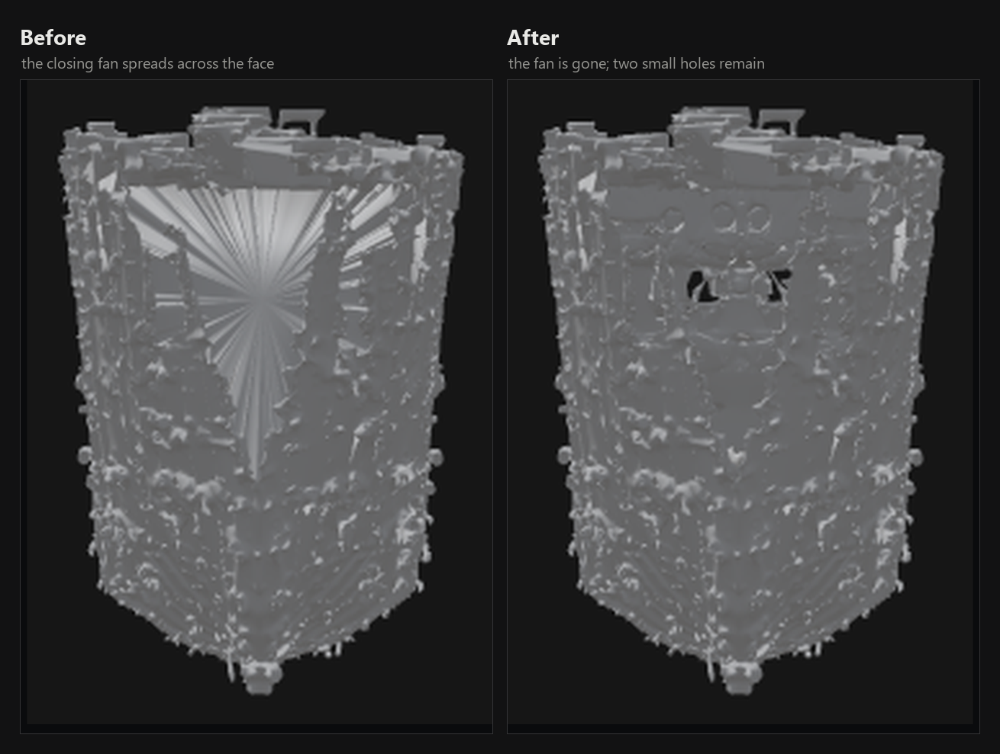

# Changelog

The engine is versioned on its own. LocalMesh, the application built on it,
has its own numbering and its own release notes; the two move at different
speeds and there is no correspondence to read into them.

Entries say what changed in the output or in the failure, and what it cost.
Refactors are not entries.

## v1.1.0 — 12 September 2026

### Hole closing no longer leaves blades across the surface

Closing a boundary loop meant filling it with a triangle fan. On a wide loop
that fan became a sheet drawn straight across the object; on a middling one it
left a single triangle crossing it, long and flat, catching the light from
every angle. The fans were rare and they carried a great deal of surface: on
one test object, 0.46% of the triangles held 17.3% of the visible area, and a
single triangle spanned a quarter of the diagonal.

Two changes, because one was not enough.

`FERMETURE_PERIMETRE` drops from 12.0 to 1.0. This is a cliff rather than a
slope — between 2 and 8 no loop has that perimeter at all, and nothing moves;
at 12 the giant loops pass, up to 58% of the object's span, and the fill spans
them.

Lowering the threshold does not clear the middling loops. The second change
judges the triangle instead of the loop: a triangle whose longest edge exceeds
5% of the object diagonal (`LAME_PART`) *and* whose elongation, longest edge
over shortest, exceeds 8 (`LAME_ALLONGEMENT`) is removed after the closing
pass. Both conditions are needed — a large well-proportioned triangle is
legitimate, a small sliver is harmless noise. A mesh coming out of dual
contouring contains none of these, on any of the ten subjects, which is what
makes the rule safe. Set `LUMENGEN_RETRAIT_LAMES=0` to keep the old behaviour.

Ten subjects were replayed from the mesh captured immediately before the
closing pass, so the comparison holds the input fixed:

| | threshold 12 | threshold 1 + removal |
|---|---|---|
| blades, ten subjects | 2,613 | 0 |
| surface invented by closing | +14% to +67% | +1.7% to +11.8% |

What it costs is the holes that stay open, and they were measured rather than
argued about: both versions were rendered from eight angles and the pixels that
were surface and became background were counted. Median 0.000% of the object's
pixels, worst case 0.027%.

A note on method, since it is the reason this went unnoticed for two days. The
threshold was raised to 12 on 9 September against two witnesses: the silhouette
(unchanged before and after) and the open-edge count (953 → 0). Neither can see
a blade. A blade lying along the surface does not move the silhouette by one
pixel, and the open-edge count falls *whenever* you fill — it is the
measurement applauding the act it is supposed to judge.

### The fine multi-view pass sizes its ceiling to the card

The fine pass refused any subject over 24,000 cells, a constant written when
nothing smaller than 8 GB could run the engine at all. It never looked at the
card. On a smaller card it admitted a subject calibrated for a larger one and
failed minutes into the work; on a larger card it refused subjects that would
have fit. The ceiling is now `max(8000, 3000 × GB)`, which yields exactly 24,000
on the 8 GB card the original measurement was made on. Override with
`LUMENGEN_PLAFOND_CELLULES`.

The refusal also used to advise dropping to a lighter tier, which is no advice
at all when you are already on the lightest. It now names the lever that exists:
fewer photographs.

### A four-view run that falls back to the older blend says so

Four photographs do not always go through the four-view path — the weights may
not be on the machine, or the tier may promise a grid the path cannot produce.
The run used to fall back to the older whole-prediction blend in silence, and
the result was simply worse than it should have been with no way to know why.
It now returns a note saying which of the two it was.

### Also

`localmesh_engine/banc/banc3d.py`, a bench that compares the produced shape
against a ground-truth model rather than counting what can be recounted in the
output file. It exists because indirect indicators misled twice in one day: a
flipped-face score of 0.43% on a back panel that was perfectly smooth and
perfectly empty, and a view weighting that scored best offline and worst on the
bench.

## v1.0.0 — 10 September 2026

The engine as first published: one photograph, or four sides of one subject,
into a textured `.glb` on a single 8 GB NVIDIA card, with no generation service
in the loop. See the [README](README.md) for what it adds to TRELLIS.2.
