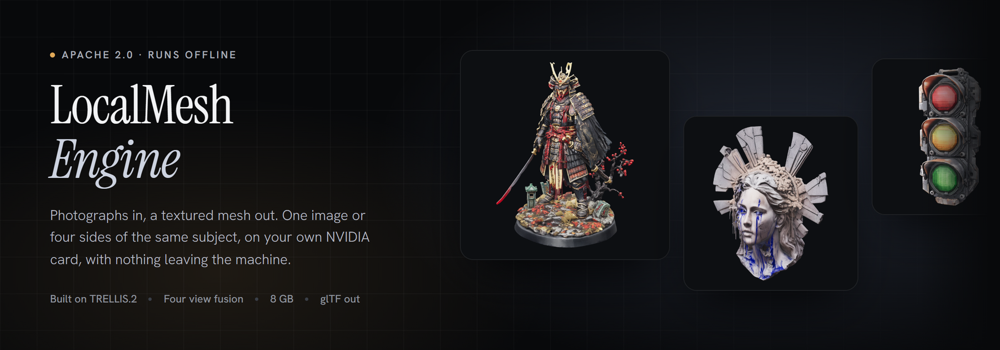
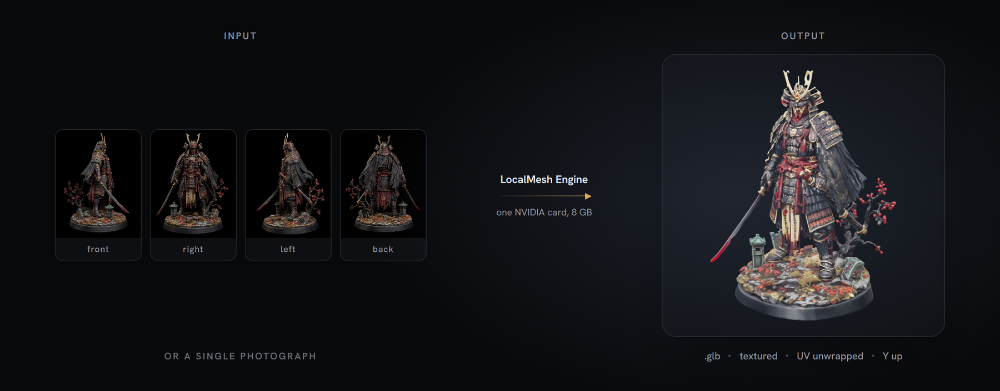
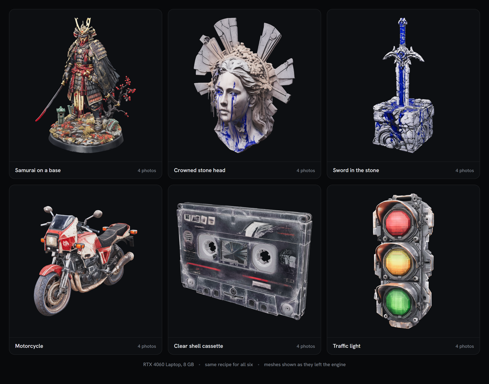
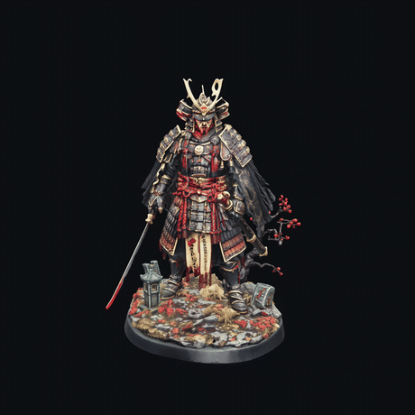
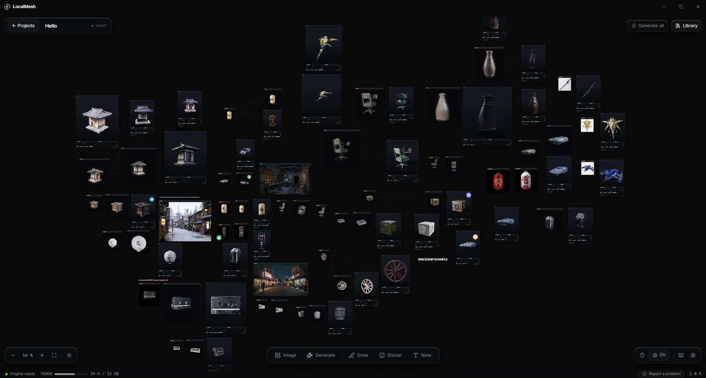

<div align="center">
  
</div>

<div align="center">

[](LICENSE) [](pyproject.toml) [](docs/INSTALL.md) [](https://huggingface.co/Qtn-Cls/LocalMeshEngine)

</div>

LocalMesh Engine turns one photograph, or four sides of the same subject, into
a textured `.glb` file on a single NVIDIA card with 8 GB of memory, with no
generation service in the loop.

**[Install guide](docs/INSTALL.md)** &nbsp;&middot;&nbsp;
**[Weights on Hugging Face](https://huggingface.co/Qtn-Cls/LocalMeshEngine)** &nbsp;&middot;&nbsp;
**[Project page](https://local-mesh.com/localmesh-engine/)** &nbsp;&middot;&nbsp;
**[LocalMesh, the application](https://local-mesh.com)**

<div align="center">
  
</div>

```bash
python -m localmesh_engine face.png --right right.png --left left.png --back back.png --to out/
```

One photograph works too, and is the shorter install:
`python -m localmesh_engine photo.png --to out/`.

---

## What this adds to TRELLIS.2

TRELLIS.2 is Microsoft Research's image to 3D model. This repository is the
generation core of LocalMesh built on it, plus six things TRELLIS.2 does not
do.

**Four photographs of one subject.** TRELLIS.2 works from a single image. The
four view path fuses front, right, left and back on one shared grid, at the
sparse structure stage and again through the shape cascade, so the fusion is
done by a network trained for it rather than by averaging afterwards. The
multi-view weights are FP8 conversions of TencentARC's Pixal3D (MIT); the
ported path follows visualbruno's ComfyUI node (MIT). It runs on the same
8 GB: the weights load one after another and the card is handed back between
stages. What it costs is disk.

**The views are measured, not declared.** Three facts about the photographs
are read from the images instead of being assumed. The azimuth each shot was
taken from, using Depth Anything 3, so a hand held turn that is not a regular
quarter turn still projects to the right pixels. Field of view, distance and
elevation stay nominal: a turn photographed from above is not corrected.
Which side each profile actually shows, as one binary answer, kept only when
two pose heads agree and the two profiles come out on opposite sides, and
reported as unknown otherwise. And the crop, which is sized on the HEIGHT of
the subject, a quantity a rotation around the vertical does not change, so the
four views reach the model at one scale. Measured on four subjects: with a per
view crop, an elongated subject arrives in profile 1.4 times smaller than in
front view.

**Debris is removed by position, not by size.** A component leaves only if it
is both small against the largest component and detached from it, distance
taken as the median of its vertices to the main shell rather than the minimum.
On the samurai bench subject the mesh carries 1,133 components, 941 of which
lie flat on the shell. Dropping the small ones would open 941 holes in the
surface.

**Materials a viewer can read.** On the texturing path metalness is written as
zero, because the model's output in that channel measures as noise. The glTF
alpha mode is read off the alpha the model produced, so an opaque object ships
opaque instead of ghosting whole. `doubleSided` follows the count of open
edges rather than being set for every asset. At tile boundaries of the dual
grid extraction, exactly one tile owns each quad, so the same oriented faces
are not emitted twice.

**8 GB is the target.** FP8 weights, staged loading, and budgets derived from
the card rather than fixed in advance. The token ceiling is 2,600 per gigabyte
of video memory, so 20,800 on an 8 GB card, where the vendored default is
49,152, a number set for a datacenter card. It is the guard on the 1536
cascade: at a shape grid of 1024 the truncation loop never goes below the
grid, so the ceiling does not bite there. The face budget follows the same
rule. When a shape overruns its budget the job resumes one tier down with the
same seed and that tier's full recipe, and the mesh note says so, instead of
failing.

**Usable in a commercial product.** The UV atlas rasteriser is rewritten in
PyTorch (`localmesh_engine/uvraster.py`). nvdiffrast, whose NVIDIA licence
limits use to research and evaluation, is called nowhere: every rasterisation
in this repository goes through that file, in the vendored TRELLIS.2 and
o_voxel code as much as in ours. `pymeshlab` (GPL-3) and `meshlib` (non
commercial agreement) are neither imported nor called. `xformers` is replaced
by a stand-in module that answers with PyTorch's own scaled dot product
attention.

### Measured times

RTX 4060 Laptop, 8 GB, six subjects, four photographs each.

| Tier | Views | Time |
|---|---|---|
| Standard, `standard` | four | 6 min 30 to 8 min 30 |
| Detailed, `high` | four | 9 min 20 to 13 min |

Texture is roughly 60 % of that time. Peak memory is read from the card
through NVML rather than from the PyTorch allocator, because the atlas bake
allocates outside it. When NVML cannot answer, the run falls back to the
allocator figure, and `GenerateResult.vram_portee` says which of the two the
number came from.

---

## Results

<div align="center">
  
</div>

<p align="center"><em>Six subjects, four photographs each, Detailed tier (<code>high</code>), RTX 4060 Laptop 8 GB.</em></p>

<div align="center">
  
</div>

<p align="center"><em>A full turn each. One pose can be chosen; a full turn cannot.</em></p>

---

## Install

Python 3.12, and a torch that the compiled extensions were built against.

```bash
git clone https://github.com/Quentincls/localmesh-engine
cd localmesh-engine

python -m venv .venv && . .venv/bin/activate     # Windows: . .venv/Scripts/activate
pip install torch==2.8.0 torchvision==0.23.0 --index-url https://download.pytorch.org/whl/cu128
pip install -e .                                 # ".[multiview]" instead, for the four view path

export LOCALMESH_ROOT=/path/to/runtime           # the folder that holds models/
# Windows PowerShell: $env:LOCALMESH_ROOT = "C:\path\to\runtime"
```

Full walkthrough in **[docs/INSTALL.md](docs/INSTALL.md)**, and where every
weight file goes in **[docs/WEIGHTS.md](docs/WEIGHTS.md)**. Nothing generates
until the three CUDA extensions below are built — on Windows with Python 3.12
and torch 2.8.0+cu128 they are
[published prebuilt](https://github.com/Quentincls/localmesh-engine/releases/tag/wheels-cp312-cu128),
with natten. Two obstacles are worth
naming here.

**Three CUDA extensions are not on PyPI.** `o_voxel` is the `o-voxel/`
subfolder of [github.com/microsoft/TRELLIS.2](https://github.com/microsoft/TRELLIS.2);
`cumesh` and `flex_gemm` have repositories of their own,
[CuMesh](https://github.com/JeffreyXiang/CuMesh) and
[FlexGEMM](https://github.com/JeffreyXiang/FlexGEMM). All three are built
against `torch==2.8.0+cu128` and Python 3.12. Another torch and they fail as a
missing DLL. Note that `pip install cumesh` SUCCEEDS and installs a different
project of the same name, after which you get an unreadable API error rather
than a clean failure. Third party Linux wheels exist at
[siraxe/TRELLIS.2-4B_cuda_12.8.r12.8_wheels](https://huggingface.co/siraxe/TRELLIS.2-4B_cuda_12.8.r12.8_wheels)
(cp312, linux_x86_64); they are not ours.

**DINOv3 is gated on manual approval.** The image encoder,
`facebook/dinov3-vitl16-pretrain-lvd1689m`, requires a Hugging Face account, a
request, and a human review on Meta's side. It is the longest step of the
install and the only one that cannot be shortened. Start it first.

One piece is fetched at run time and not by hand: BiRefNet_HR, the subject
cutout, is pulled from the Hub on the first generation if the cache is empty,
and loaded with `trust_remote_code=True`. Everything else has to be in place
before the engine starts.

---

## Use

```bash
# one photograph
python -m localmesh_engine photo.png --to out/

# four sides of the same subject
python -m localmesh_engine face.png --right right.png --left left.png --back back.png --to out/

# a tier and a fixed seed
python -m localmesh_engine photo.png --tier high --seed 42 --to out/
```

`--tier` takes `draft`, `standard`, `high` or `max`, and defaults to
`standard`. `--seed` at -1 draws a random one.

The code is written in French, and every flag also answers to its French
name: `--droite`, `--gauche`, `--dos`, `--palier`, `--graine`, `--vers`. The
two spellings are the same flag. Progress is written to
standard error, one line per stage, so the result path on standard output
stays clean. The four view path wants all three sides: an incomplete set is
refused rather than silently downgraded.

The Python API is the same engine, without the process boundary.

```python
from pathlib import Path
from localmesh_engine import Engine, GenerateSettings

engine = Engine()

settings = GenerateSettings(
    images=[Path("face.png")],
    vues={"droite": Path("right.png"),
          "gauche": Path("left.png"),
          "dos": Path("back.png")},
    detail="standard",
    seed=42,
)

result = engine.generate(settings, Path("out/"))
print(result.glb_path, result.faces, result.peak_vram_gb)
```

`generate()` also takes `progress`, `should_cancel` and `on_preview`
callbacks. `GenerateResult` carries the mesh counts, the wall clock per stage,
the peak memory read from the card, and the notes the run produced.

---

### Reproduce the samurai

`examples/samurai/` carries the four photographs the banner and the gallery
were made from. They were generated with ChatGPT Image, so they ship with the
repository.

```bash
python -m localmesh_engine examples/samurai/front.png   --right examples/samurai/right.png   --left examples/samurai/left.png   --back examples/samurai/back.png   --tier standard --seed 101 --to out/
```

On an RTX 4060 Laptop with 8 GB this takes 8 minutes and returns a mesh of
about 148,000 faces, peaking at 5.9 GB of video memory. The roles matter: the
engine measures the angles it was given, but `front` has to be the photograph
that carries the shape.

## Quality tiers

A tier is a contract, not a slider. Changing one of these values changes the
contract, and therefore the version of the engine.

| | Draft | Standard | Detailed | Extreme |
|---|---|---|---|---|
| Identifier | `draft` | `standard` | `high` | `max` |
| Shape grid | 512 | 1024 | 1024 | 1536 cascade |
| Steps, the same for structure, shape and texture | 8 | 12 | 16 | 16 |
| Texture atlas | 2048 | 4096 | 4096 | 8192 |
| Face budget | 80,000 | 150,000 | 250,000 | 400,000 |
| Texture guidance | 1 | 5 | 5 | 5 |
| Memory required | none | none | none | 24 GB |
| Four view path | yes | yes | yes | older blend |

Standard is the default. From Draft to Standard everything doubles, and that
is the visible jump. From Standard to Detailed the grid does not move: you buy
steps and triangles, not silhouette. Extreme is the only tier that raises the
grid, and the only one that asks for memory. Its 24 GB floor is derived from
how memory follows cell count, not observed: no card that size has run it
here.

The four view path serves Draft, Standard and Detailed. Its shape cascade
always ends at 1024, so on Draft it returns more than the tier promises and
takes longer for it. The multi-view weights exist at 512 and 1024 only, so
Extreme falls back to the older blend rather than deliver a Standard shape
under another label. That older blend also runs when the multi-view weights
are simply not in place: four photographs still produce a mesh, and the run
does not report which of the two mixed them.

Full table, budgets derived from the card, and the rule for changing a recipe:
**[docs/RECIPES.md](docs/RECIPES.md)**. What a change has to carry before it is
read: **[CONTRIBUTING.md](CONTRIBUTING.md)**.

---

## What it needs

- An NVIDIA card with 8 GB of video memory. Eight is the size the recipes were
  fitted to, and the peak figures above were measured there.
- Windows or Linux.
- Python 3.12, with `torch==2.8.0` built for CUDA 12.8.
- Disk for the weights: about 9.5 GB for the single photograph path, 14.3 GB
  with the four views. File by file in
  **[docs/WEIGHTS.md](docs/WEIGHTS.md)**.

---

## Licence and credits

This code is **Apache-2.0**. See [LICENSE](LICENSE). Code copied from other
projects keeps its own licence, and every one of them is a free licence.

The code sits under `localmesh_engine/`, and the paths below are relative to it.

| Part | Origin | Licence |
|---|---|---|
| `_vendu_trellis2/` | TRELLIS.2 inference code, Microsoft Research | MIT, Copyright (c) Microsoft Corporation |
| `_vendu_trellis2/`, multi-view files | TencentARC/Pixal3D | MIT, Copyright (c) 2026 Tencent |
| `_vendu_trellis2/`, ported multi-view path | visualbruno, ComfyUI-Trellis2 | MIT |
| `_vendu_o_voxel/` | o_voxel, the PBR volume to UV bake of TRELLIS.2, Microsoft Research | MIT, Copyright (c) Microsoft Corporation |
| `multivue/champ/` | valeoai/NAF, revision 37f2dfc | Apache-2.0 |

No weights are stored in this git repository. The FP8 multi-view conversions
we produced are served from
[huggingface.co/Qtn-Cls/LocalMeshEngine](https://huggingface.co/Qtn-Cls/LocalMeshEngine)
and are conversions of the official BF16 Pixal3D weights: weight RMSE 0.025 to
0.026 against the source, projection probe 0.027. Every other weight set is
downloaded from its author and keeps its own licence, listed with its address
in [NOTICE](NOTICE).

**Built with DINOv3.** Using the DINOv3 image encoder carries conditions from
Meta: anyone redistributing those weights ships a copy of the agreement with
them, requires the recipient to accept the same terms, and displays this line
somewhere visible. We do not redistribute them; the line is due all the same,
and it stays due in any application built on this engine.

---

## Citation

```bibtex
@software{colus2026localmeshengine,
  author  = {Colus, Quentin},
  title   = {LocalMesh Engine},
  year    = {2026},
  version = {1.0.0},
  license = {Apache-2.0},
  url     = {https://github.com/Quentincls/localmesh-engine}
}
```

The same entry is in [CITATION.cff](CITATION.cff), which GitHub reads.

The upstream work this engine is built on, to be cited alongside it. Both
projects publish their own entry, with their own authors and title: take it
from the source rather than from here.

- TRELLIS.2, Microsoft Research, arXiv:2512.14692,
  [github.com/microsoft/TRELLIS.2](https://github.com/microsoft/TRELLIS.2)
- Pixal3D, TencentARC, arXiv:2605.10922,
  [huggingface.co/TencentARC/Pixal3D](https://huggingface.co/TencentARC/Pixal3D)

---

LocalMesh, the application built on this engine, is at
[local-mesh.com](https://local-mesh.com): the same generation core with an
interface, a library and a viewer, for people who would rather not install any
of the above.

<div align="center">
  
</div>
